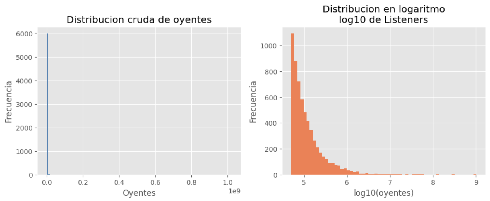
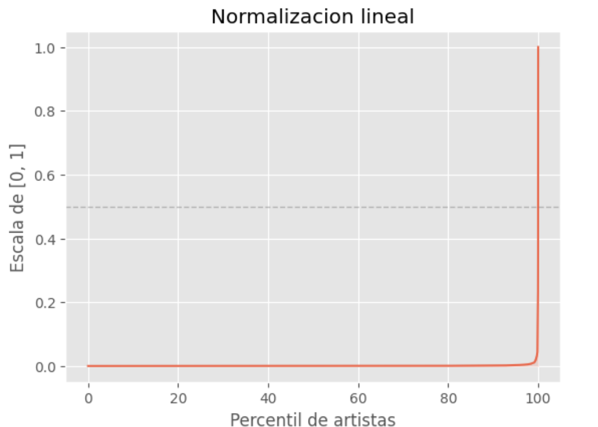
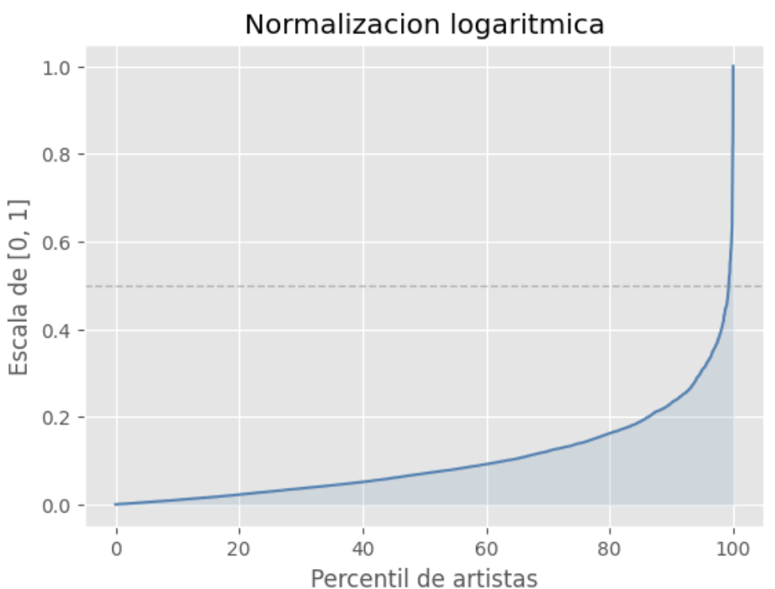
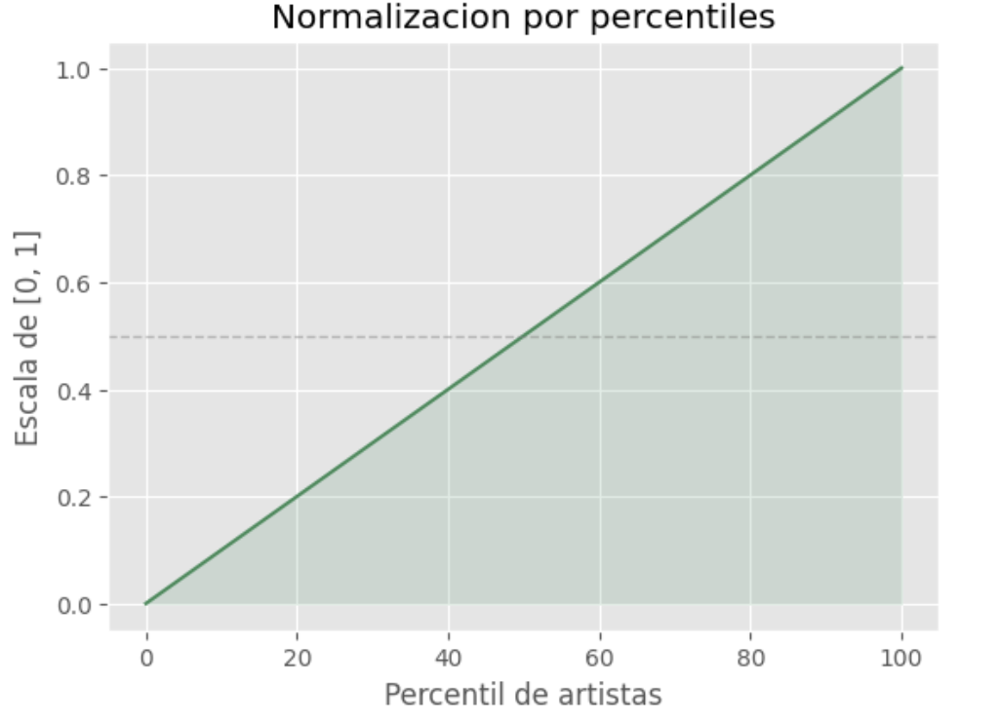
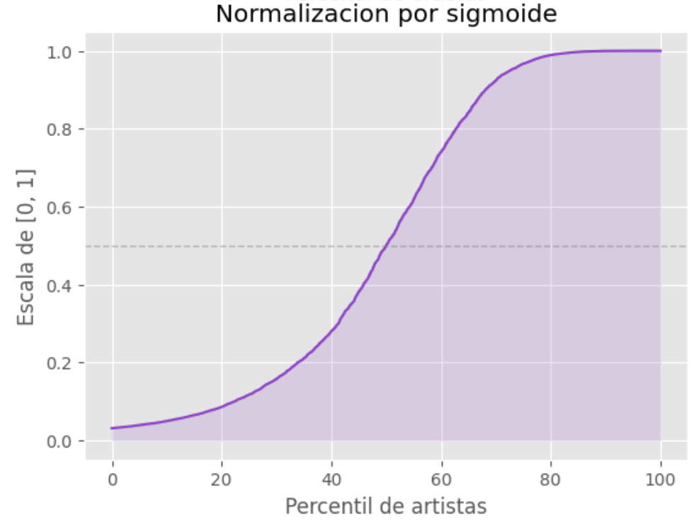
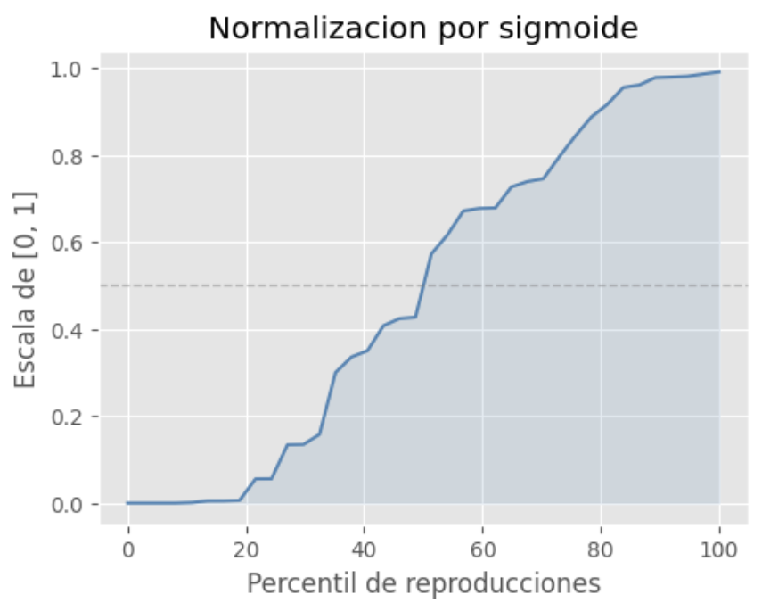

# Laboratorio de Datos: Analisis y Coeficiente de Popularidad

## Objetivo del Experimento
Este notebook documenta el proceso de investigacion y extraccion de datos (ETL) necesario para alimentar el [Motor Dinamico de Precios](documentacion_motor_dinamico.md). 

El objetivo principal es resolver dos problemas:
1. Encontrar el modelo matematico adecuado para normalizar la inmensa brecha de reproducciones entre artistas, ya que estos datos se comportan en una distribucion de cola larga.
2. Construir un dataset inicial representativo del consumo real del publico objetivo (Festival Nacional del Poncho).

---

## 1. El Problema de la "Cola Larga"
La industria musical sigue una distribucion de Pareto (Ley de Potencias), donde el 1% de los artistas concentra la inmensa mayoria de las escuchas. 

En la primera parte del notebook, se simulan datos poblacionales ($N=6000$) y se contrastan con las reproducciones reales de bandas masivas. La conclusion de estos datos en los histogramas es clara: una escala lineal directa no es factible porque asignaria multiplicadores altisimos a una minoria y multiplicadores nulos al resto. Es obligatorio aplicar una transformaciin logaritmica (`log10`) para suavizar la curva.

    

---

## 2. Evaluacion de Modelos de Normalizacion
Para traducir el volumen de reproducciones a un coeficiente acotado (escala de 0 a 1, que luego se traduce a un aumento del 0% al 100%), se evaluaron graficamente cuatro aproximaciones matematicas:

* Lineal (`minmax_lineal`): Es el metodo mas directo, toma el conjunto de datos y los comprime para que encajen en el rango de 0 a 1. 
Manteiene intactas las distancias entre numeros, lo que la hace inutil para mitigar los valores extremos (outlier). Descartada por la extrema polarizacion generada por la Ley de Potencias.

    

    
* Logaritmica (`log_minmax`): Antes de aplicar una normalizacion como en el metodo anterior, se aplica logaritmo de base 10 a cada valor (como el logaritmo de 0 no existe se suma 1). Esto hace que se desacelere el crecimiento en base a ordenes de magnitud (lo que quiere decir que pasar de 10 a 100 es lo mismo que pasar de 1000 a 10000). Mejora la distribucion, pero sigue siendo sensible a maximos y minimos absolutos.

    

* Por Percentiles (`percentil_rank`): Una funcion directamente importada de la libreria scipy.stats, submodulo de Scipy, enfocada en la estadistica de datos masivos, funciones de probabilidad y transformaciones matematicas. Esta funcion ignora las distancias metricas absolutas entre los valores y se concentra exclusivamente en su posicion relativa u orden dentro de un conjunto de datos. El problema que tiene es que pierde la nocion de magnitud absoluta entre artistas.

    

* Sigmoide Logaritmica (`log_sigmoide`): El cual es el modelo de normalizacion seleccionado. Utiliza el z-score sobre el logaritmo de los datos y aplica una funcion logistica. Normalmente esta funcion utiliza el valor de la media, lo que daria problemas ante valores extremos (outliers). Por eso esta funcion sigmoide particularmente utiliza la mediana (expresa el valor mas popular dentro de los datos) lo que hace que esta funcion sea mucho mas resistente a los valores extremos y garantiza un crecimiento suave y predecible.

    

---

## 3. Adquisicion de Datos Reales (YouTube API)
Identificado el modelo matematico, surgio la necesidad de contar con datos reales para calcular la varianza y la mediana poblacional (`sigma` y `mu`). 

Debido a las estrictas limitaciones de rate limiting de la API de Last.fm y su sesgo anglosajon, se migro la fuente de datos a la API de YouTube. Creamos un "micro-universo", o "regla de medir", de artistas segmentado segun las categorias de mayor impacto historico en el Festival del Poncho:
* Folklore
* Cuarteto
* Cumbia
* Urbano / Trap
* Rock Nacional

Para matener esta "regla de medir" en el tiempo se creo el [Jupyter Notebook](persistencia_de_regla.ipynb) para ser ejecutado de vez en cuando y actualizar la [Regla de medir](micro_universo_artistas.csv)

### El sigmoide conseguido con estos datos es:

    

---

## 4. Resultado Final
Este archivo, la regla de medir, contiene una muestra reproducciones reales sobre 39 artistas de distintas escalas dentro de las categorias mas importantes para el Poncho, proporcionando la linea base estadistica (`df_artistas`) que se utiliza en el sistema Django para inicializar el [Motor Dinamico](apps/core/engine.py).